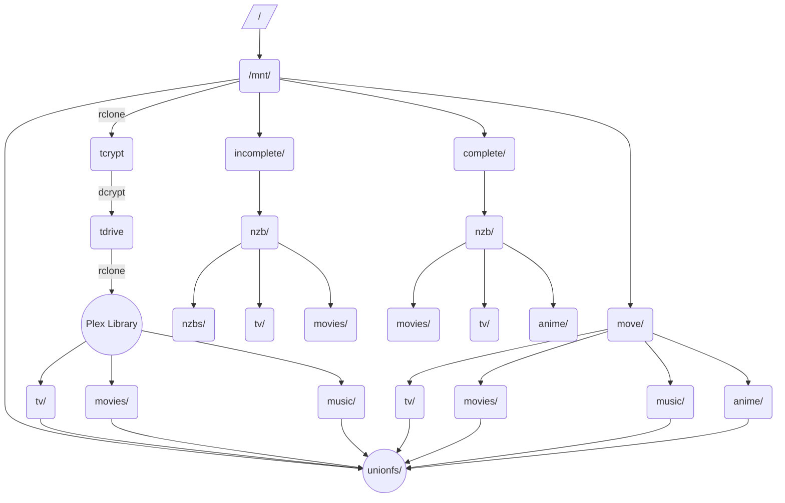

```mermaid 
graph TD

HOST[///] --> MNT(/mnt/) -->|rclone| RTC(tcrypt)

RTC -->|dcrypt| RTD(tdrive)

  

MNT --> INC(incomplete/)

MNT --> COM(complete/)

MNT --> UFS((unionfs/))

RTD -->|rclone| LIB((Plex Library))

  

LIB --> LTV(tv/) --> UFS

LIB --> LMOV(movies/) --> UFS

LIB --> LMUS(music/) --> UFS

  

MNT --> MOV(move/)

  

MOV --> MTV(tv/) --> UFS

MOV --> MMOV(movies/) --> UFS

MOV --> MMUS(music/) --> UFS
MOV --> MANM(anime/) --> UFS

  

INC --> NZBI(nzb/)

NZBI --> NZBS(nzbs/)

NZBI --> NZBITV(tv/)

NZBI --> NZBIM(movies/)

  

COM --> NZB(nzb/)

  

NZB --> NZBM(movies/)

NZB --> NZBTV(tv/)

NZB --> NZBA(anime/)
```