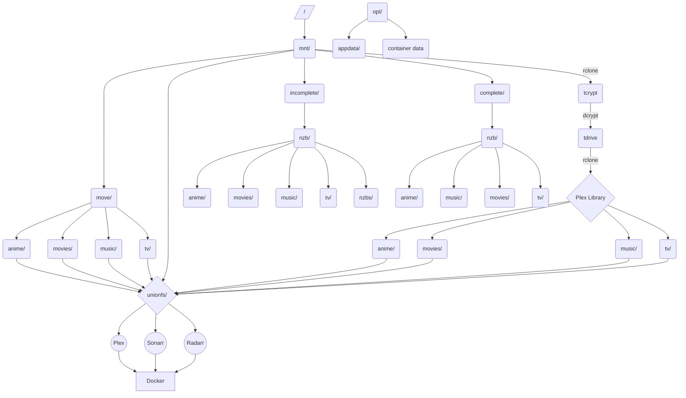

```mermaid 
graph TD

HOST[///] --> MNT(mnt/) -->|rclone| RTC(tcrypt) -->|dcrypt| RTD(tdrive)

RTD -->|rclone| LIB{Plex Library}

OPT(opt/)

OPT --> APPDATA(appdata/)
OPT --> CONDATA(container data)

MNT --> MOV(move/)

MOV --> MANM(anime/) --> UFS
MOV --> MMOV(movies/) --> UFS
MOV --> MMUS(music/) --> UFS
MOV --> MTV(tv/) --> UFS

MNT --> UFS{unionfs/}
MNT --> INC(incomplete/)
MNT --> COM(complete/)

LIB --> LANM(anime/) --> UFS
LIB --> LMOV(movies/) --> UFS
LIB --> LMUS(music/) --> UFS
LIB --> LTV(tv/) --> UFS

INC --> NZBI(nzb/)

NZBI --> NABA(anime/)
NZBI --> NZBIM(movies/)
NZBI --> NZBIMU(music/)
NZBI --> NZBITV(tv/)
NZBI --> NZBS(nzbs/)

COM --> NZB(nzb/)

NZB --> NZBA(anime/)
NZB --> NZBMU(music/)
NZB --> NZBM(movies/)
NZB --> NZBTV(tv/)

UFS --> PLEX((Plex))
UFS --> SONR((Sonarr))
UFS --> RADR((Radarr))

PLEX --> DOCKER[Docker]
SONR --> DOCKER
RADR --> DOCKER
```